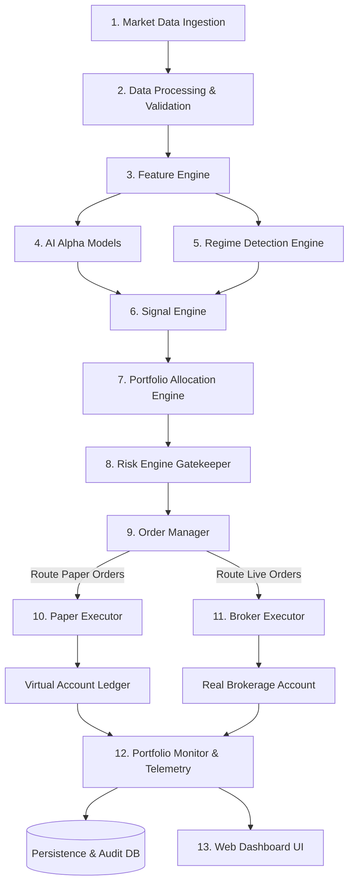

# S&P 500 Autonomous AI Trading System - System Architecture Specification

**Document Version:** 1.0.0  
**Phase:** PHASE 01 - System Architecture  
**Status:** Approved / Baseline  

---

## 1. High-Level Target Architecture

The **S&P 500 Autonomous AI Trading System** follows a strictly decoupled, unidirectional pipeline for strategy and risk analysis, terminating in an interchangeable execution boundary.



---

## 2. Component Responsibilities & Module Boundaries

The system is decomposed into 13 cohesive, loosely coupled components organized across 5 architectural layers:

```
┌─────────────────────────────────────────────────────────────────────────────┐
│ 1. Data Layer: Market Data Ingestion, Data Processing, Feature Engine      │
├─────────────────────────────────────────────────────────────────────────────┤
│ 2. Intelligence Layer: AI Models, Regime Detection, Signal Engine           │
├─────────────────────────────────────────────────────────────────────────────┤
│ 3. Portfolio & Risk Layer: Portfolio Allocation Engine, Risk Engine         │
├─────────────────────────────────────────────────────────────────────────────┤
│ 4. Execution Layer: Order Manager, Paper Executor, Broker Executor          │
├─────────────────────────────────────────────────────────────────────────────┤
│ 5. Surveillance & Presentation Layer: Portfolio Monitor, Web Dashboard      │
└─────────────────────────────────────────────────────────────────────────────┘
```

---

### Component Specifications

#### 1. Market Data (`market_data`)
- **Primary Responsibility:** Ingest raw historical bars and real-time tick/quote/bar streams from configured data providers (e.g., Alpaca, Polygon, IEX).
- **Boundaries:** Connects exclusively to external broker/market APIs and delivers raw data payloads to the Data Processing module.
- **Concurrency:** Asynchronous / WebSocket listener thread with non-blocking buffer.

#### 2. Data Processing (`data_processing`)
- **Primary Responsibility:** Clean, validate, normalize, and time-align raw multi-asset market data. Detect missing ticks, handle market halts, adjust for corporate actions (splits/dividends), and construct consistent multi-timeframe OHLCV bar series.
- **Boundaries:** Consumes raw market data; produces validated, immutable `BarData` and `QuoteData` series.
- **Concurrency:** Synchronous batch processing or real-time event pipeline with sub-millisecond execution.

#### 3. Feature Engine (`feature_engine`)
- **Primary Responsibility:** Calculate rolling technical indicators (RSI, MACD, Bollinger Bands, ATR), order flow metrics, momentum vectors, volatility measures, and cross-sectional S&P 500 statistical features without lookahead bias.
- **Boundaries:** Consumes validated bars; outputs structured `FeatureMatrix` and `FeatureVector` payloads.
- **Concurrency:** High-performance vectorized calculation (NumPy / Polars / Numba).

#### 4. AI Models (`ai_models`)
- **Primary Responsibility:** Execute forward inference using trained machine learning models (e.g., Gradient Boosted Trees, Temporal Neural Networks, Ensemble Meta-Learners) to predict asset return distributions, directional probabilities, and volatility expectations.
- **Boundaries:** Consumes `FeatureVector`; outputs raw model predictions (`ModelPrediction` with directional score, probability distribution, and confidence score).
- **Concurrency:** Thread-isolated / batch inference worker (<20ms latency target).

#### 5. Regime Detection (`regime_detection`)
- **Primary Responsibility:** Identify the prevailing macroeconomic and market state across multiple horizons (e.g., Bull Trending, Bear Trending, Mean-Reverting / Low Volatility, High Volatility Crisis).
- **Boundaries:** Consumes market features and index-level metrics; outputs `MarketRegimeState` (regime tag, volatility index, regime confidence).
- **Concurrency:** Evaluated on bar closures or scheduled intervals.

#### 6. Signal Engine (`signal_engine`)
- **Primary Responsibility:** Synthesize AI model predictions with the active market regime to generate actionable trading signals (`BUY`, `SELL`, `HOLD`) with strict entry/exit conditions, target holding periods, and confidence weights.
- **Boundaries:** Consumes `ModelPrediction` and `MarketRegimeState`; outputs normalized `TradingSignal` objects.
- **Concurrency:** Synchronous deterministic state machine.

#### 7. Portfolio Engine (`portfolio_engine`)
- **Primary Responsibility:** Transform raw trading signals into desired target portfolio weights and concrete position allocations using risk-parity, volatility-adjusted Kelly criterion, and cash management rules.
- **Boundaries:** Consumes `TradingSignal` and current `PortfolioState`; outputs `TargetAllocation` and proposed `OrderIntent`.
- **Concurrency:** Synchronous calculation.

#### 8. Risk Engine (`risk_engine`)
- **Primary Responsibility:** Central deterministic gatekeeper. Enforces pre-trade hard limits (max position size, max sector concentration, max daily loss, portfolio drawdown circuit breakers, margin buffers, order rate limits) and manages trailing stops / take-profits.
- **Boundaries:** Consumes proposed `OrderIntent` and `PortfolioState`; approves, modifies, or rejects orders, yielding authorized `ValidatedOrder` instances.
- **Concurrency:** Synchronous, non-bypassable, single-threaded critical section.

#### 9. Order Manager (`order_manager`)
- **Primary Responsibility:** Manage order lifecycles (creation, routing, status tracking, cancellation, replacement). Routes validated orders to the bound `ExecutionInterface` without knowledge of whether the destination is Paper or Live.
- **Boundaries:** Consumes `ValidatedOrder`; tracks active `OrderRecord` states; receives `ExecutionReport` callbacks.
- **Concurrency:** Asynchronous state machine handling order events and state transitions.

#### 10. Paper Executor (`paper_executor`)
- **Primary Responsibility:** High-fidelity simulation of trade execution. Emulates exchange order matching, latency, spread crossing, liquidity consumption, partial fills, and slippage against virtual account balances.
- **Boundaries:** Implements `ExecutionInterface`; interacts with `VirtualAccountLedger`.
- **Concurrency:** Event-driven simulated execution loop.

#### 11. Broker Executor (`broker_executor`)
- **Primary Responsibility:** Live order routing to certified brokerage APIs (e.g., Alpaca, Interactive Brokers). Manages REST order requests, WebSocket fill streams, broker error recovery, nonce management, and rate-limit backoff.
- **Boundaries:** Implements `ExecutionInterface`; interacts with external Broker APIs and `RealAccountState`.
- **Concurrency:** Async I/O network client with circuit breaker resilience.

#### 12. Portfolio Monitor (`portfolio_monitor`)
- **Primary Responsibility:** Real-time surveillance of open positions, mark-to-market P&L, cumulative performance metrics (Sharpe, Drawdown, Win Rate), execution latency, and system health telemetry. Streams events to persistent storage and the web dashboard.
- **Boundaries:** Consumes fill events and market ticks; publishes telemetry via WebSocket and commits audit logs to database.
- **Concurrency:** Asynchronous event distributor / telemetry publisher.

#### 13. Dashboard (`dashboard`)
- **Primary Responsibility:** Institutional web-based visualization and operator control center. Displays live portfolio curves, regime indicators, open positions, recent order logs, telemetry health, and provides operator controls (Emergency Kill Switch, manual pause/resume, risk dial adjustment).
- **Boundaries:** Frontend client consuming REST APIs and WebSockets from the backend service.
- **Concurrency:** Browser-based UI running independently of the core trading loop.

---

## 3. Data Flow & Event Progression

```
[External Market] 
       │ (Tick/Bar Event)
       ▼
┌──────────────────┐    ValidatedBar    ┌──────────────────┐
│   Market Data    │ ─────────────────> │ Data Processing  │
└──────────────────┘                    └──────────────────┘
                                                  │
                                                  │ FeatureVector
                                                  ▼
                                        ┌──────────────────┐
                                        │  Feature Engine  │
                                        └──────────────────┘
                                          │              │
                           FeatureVector  │              │ FeatureVector
                                          ▼              ▼
                                ┌───────────────┐ ┌───────────────────┐
                                │   AI Models   │ │ Regime Detection  │
                                └───────────────┘ └───────────────────┘
                                        │                   │
                        ModelPrediction │                   │ MarketRegimeState
                                        └─────────┬─────────┘
                                                  ▼
                                        ┌───────────────────┐
                                        │   Signal Engine   │
                                        └───────────────────┘
                                                  │
                                                  │ TradingSignal
                                                  ▼
                                        ┌───────────────────┐
                                        │ Portfolio Engine  │
                                        └───────────────────┘
                                                  │
                                                  │ OrderIntent
                                                  ▼
                                        ┌───────────────────┐
                                        │    Risk Engine    │  [REJECT] ──> Log & Alert
                                        └───────────────────┘
                                                  │ [PASS / MODIFIED]
                                                  │ ValidatedOrder
                                                  ▼
                                        ┌───────────────────┐
                                        │   Order Manager   │
                                        └───────────────────┘
                                                  │
                                                  │ OrderCommand
                                                  ▼
                                    ┌───────────────────────────┐
                                    │    ExecutionInterface     │
                                    │ ┌───────────┐ ┌─────────┐ │
                                    │ │   Paper   │ │  Live   │ │
                                    │ └───────────┘ └─────────┘ │
                                    └───────────────────────────┘
                                                  │
                                                  │ ExecutionReport / FillEvent
                                                  ▼
                                        ┌───────────────────┐
                                        │ Portfolio Monitor │
                                        └───────────────────┘
                                         │                 │
                           Audit Records │                 │ WebSocket Events
                                         ▼                 ▼
                                    ┌───────────┐    ┌───────────┐
                                    │ Database  │    │ Dashboard │
                                    └───────────┘    └───────────┘
```

---

## 4. Interface Contracts & Component Protocols

Below are the normative interface contracts (expressed in Python Protocol/Typing abstractions) governing all inter-component boundaries.

### 4.1 Core Domain Entities (Immutable Data Transfer Objects)

```python
from dataclasses import dataclass
from datetime import datetime
from enum import Enum
from typing import Dict, List, Optional

class ExecutionMode(str, Enum):
    PAPER = "PAPER"
    LIVE = "LIVE"

class SignalSide(str, Enum):
    BUY = "BUY"
    SELL = "SELL"
    HOLD = "HOLD"

class OrderType(str, Enum):
    MARKET = "MARKET"
    LIMIT = "LIMIT"
    STOP_LIMIT = "STOP_LIMIT"

class OrderStatus(str, Enum):
    PENDING = "PENDING"
    SUBMITTED = "SUBMITTED"
    PARTIALLY_FILLED = "PARTIALLY_FILLED"
    FILLED = "FILLED"
    CANCELLED = "CANCELLED"
    REJECTED = "REJECTED"

class MarketRegime(str, Enum):
    BULL_TREND = "BULL_TREND"
    BEAR_TREND = "BEAR_TREND"
    SIDEWAYS_LOW_VOL = "SIDEWAYS_LOW_VOL"
    HIGH_VOL_CRISIS = "HIGH_VOL_CRISIS"

@dataclass(frozen=True)
class BarData:
    symbol: str
    timestamp: datetime
    open: float
    high: float
    low: float
    close: float
    volume: float
    vwap: Optional[float] = None

@dataclass(frozen=True)
class FeatureVector:
    symbol: str
    timestamp: datetime
    features: Dict[str, float]

@dataclass(frozen=True)
class MarketRegimeState:
    regime: MarketRegime
    volatility_score: float
    confidence: float
    timestamp: datetime

@dataclass(frozen=True)
class ModelPrediction:
    symbol: str
    timestamp: datetime
    expected_return: float
    probability_up: float
    confidence: float
    model_version: str

@dataclass(frozen=True)
class TradingSignal:
    symbol: str
    timestamp: datetime
    side: SignalSide
    confidence: float
    target_holding_bars: int
    rationale: str

@dataclass(frozen=True)
class OrderIntent:
    symbol: str
    side: SignalSide
    order_type: OrderType
    target_quantity: float
    limit_price: Optional[float] = None
    stop_price: Optional[float] = None
    signal_id: Optional[str] = None

@dataclass(frozen=True)
class ValidatedOrder:
    order_id: str
    symbol: str
    side: SignalSide
    order_type: OrderType
    quantity: float
    limit_price: Optional[float]
    stop_price: Optional[float]
    timestamp: datetime
    risk_approval_token: str

@dataclass(frozen=True)
class ExecutionReport:
    order_id: str
    symbol: str
    status: OrderStatus
    filled_quantity: float
    remaining_quantity: float
    average_fill_price: float
    last_fill_price: float
    commission: float
    timestamp: datetime
    execution_mode: ExecutionMode
    error_message: Optional[str] = None

@dataclass(frozen=True)
class Position:
    symbol: str
    quantity: float
    average_entry_price: float
    current_market_price: float
    unrealized_pnl: float
    realized_pnl: float
    last_updated: datetime

@dataclass(frozen=True)
class PortfolioState:
    cash: float
    equity: float
    margin_used: float
    positions: Dict[str, Position]
    peak_equity: float
    current_drawdown_pct: float
    daily_pnl: float
    timestamp: datetime
```

---

### 4.2 Component Interface Definitions

```python
from typing import Protocol, List, Dict, Optional

class IDataProcessor(Protocol):
    def process_raw_bar(self, raw_payload: dict) -> BarData:
        """Validate and clean incoming bar payload."""
        ...

class IFeatureEngine(Protocol):
    def compute_features(self, symbol: str, history: List[BarData]) -> FeatureVector:
        """Compute feature set without lookahead bias."""
        ...

class IRegimeDetector(Protocol):
    def detect_regime(self, index_features: FeatureVector) -> MarketRegimeState:
        """Classify current macro/market regime."""
        ...

class IAIModelEngine(Protocol):
    def predict(self, feature_vector: FeatureVector) -> ModelPrediction:
        """Generate model inference prediction."""
        ...

class ISignalEngine(Protocol):
    def generate_signal(
        self, 
        prediction: ModelPrediction, 
        regime: MarketRegimeState
    ) -> TradingSignal:
        """Synthesize signal from predictions and regime."""
        ...

class IPortfolioEngine(Protocol):
    def calculate_allocations(
        self, 
        signals: List[TradingSignal], 
        portfolio_state: PortfolioState
    ) -> List[OrderIntent]:
        """Compute optimal position allocations and order intents."""
        ...

class IRiskEngine(Protocol):
    def validate_order(
        self, 
        order_intent: OrderIntent, 
        portfolio_state: PortfolioState
    ) -> Optional[ValidatedOrder]:
        """Enforce risk checks; returns ValidatedOrder or None if rejected."""
        ...
    
    def check_portfolio_drawdown(self, portfolio_state: PortfolioState) -> bool:
        """Return True if safe, False if circuit breaker tripped."""
        ...

    def trigger_kill_switch(self, reason: str) -> None:
        """Emergency stop: cancel all orders, halt new entries."""
        ...

class IExecutionInterface(Protocol):
    """
    Decoupled Execution Interface implemented by both PaperExecutor and BrokerExecutor.
    """
    def submit_order(self, order: ValidatedOrder) -> ExecutionReport:
        """Submit validated order for execution."""
        ...

    def cancel_order(self, order_id: str) -> bool:
        """Cancel an open order."""
        ...

    def get_order_status(self, order_id: str) -> ExecutionReport:
        """Query status of an active or past order."""
        ...

    def get_account_state(self) -> PortfolioState:
        """Fetch current portfolio/account balance and positions."""
        ...

class IPortfolioMonitor(Protocol):
    def on_execution_report(self, report: ExecutionReport) -> None:
        """Reconcile position after execution report."""
        ...

    def on_price_update(self, symbol: str, price: float) -> None:
        """Update mark-to-market valuations."""
        ...

    def publish_telemetry(self) -> dict:
        """Publish system state to dashboard and logging systems."""
        ...
```

---

## 5. Synchronous vs Asynchronous Responsibilities

| Subsystem | Execution Model | Rationale |
|---|:---:|---|
| **Market Data Ingestion** | **Asynchronous** (AsyncIO / WebSockets) | Non-blocking streaming I/O; prevents dropped network packets during market surges. |
| **Data Validation & Normalization** | **Synchronous** | Deterministic processing of bar sequences prior to downstream propagation. |
| **Feature Engineering & Inference** | **Synchronous / Worker Threads** | Heavy numerical calculations optimized with vectorized libraries and thread pools. |
| **Signal & Portfolio Sizing** | **Synchronous** | Strict sequential logic depending on latest portfolio snapshot. |
| **Risk Validation (Gatekeeper)** | **Synchronous (Single-Threaded Gate)** | Critical section; prevents race conditions on margin and exposure limits. |
| **Order Routing & Dispatch** | **Asynchronous** | I/O-bound network communication with broker APIs or virtual simulation queues. |
| **Telemetry & Dashboard Sync** | **Asynchronous** (WebSocket Broadcast) | Decouples UI rendering and network latency from the trading execution engine. |

---

## 6. Error Boundaries & Failure Domains

To guarantee zero catastrophic failures, error boundaries isolate subsystems:

1. **Market Data Failure Boundary:**
   - *Failure:* Stale data, WebSocket disconnect, missing bars.
   - *Containment:* Heartbeat monitor triggers Data Stale alert. Risk Engine automatically forbids new order entries until feed health recovers.
2. **Model Inference Failure Boundary:**
   - *Failure:* Model timeout, numerical exception (NaN/Inf in features), missing feature key.
   - *Containment:* Default fallback to `HOLD` signal with 0.0 confidence score. Error logged to telemetry; trading loop continues for other symbols.
3. **Risk Gatekeeper Boundary:**
   - *Failure:* Risk parameters unreadable, state synchronization error.
   - *Containment:* **Fail-Closed Principle:** If risk validation cannot deterministically confirm safety, the order is unconditionally rejected.
4. **Broker / Execution Failure Boundary:**
   - *Failure:* Broker API HTTP 5xx, network timeout, rate limit exceeded (HTTP 429).
   - *Containment:* Order Manager marks order `FAILED` or retries with exponential backoff. In-flight state remains synchronized without duplicate submissions.
5. **Global Circuit Breaker Boundary:**
   - *Failure:* Portfolio drawdown breaches maximum threshold (e.g. 6%) or system unhandled panic.
   - *Containment:* Programmatic invocation of `trigger_kill_switch()`. Cancels all open orders, flags alert on dashboard, and transitions system to read-only surveillance mode.

---

## 7. Component Dependencies & Layering Hierarchy

Dependencies flow strictly downwards from presentation to low-level infrastructure; upstream components never depend directly on downstream components:

```
[Layer 5: Presentation & API] (Dashboard, REST/WS Gateway)
           │
           ▼
[Layer 4: Orchestration & Surveillance] (Portfolio Monitor, Order Manager)
           │
           ▼
[Layer 3: Core Domain & Strategy] (Signal Engine, Portfolio Engine, Risk Engine)
           │
           ▼
[Layer 2: Modeling & Features] (AI Models, Regime Detection, Feature Engine)
           │
           ▼
[Layer 1: Infrastructure & Data] (Data Pipeline, Execution Adapters, DB/Persistence)
```

---

## 8. Strategy & Risk Independence from Execution Mode

As mandated by architectural rules:
- **Zero Mode Switching in Trading Logic:** Strategy, signal, sizing, and risk modules operate exclusively on domain primitives (`TradingSignal`, `OrderIntent`, `ValidatedOrder`, `PortfolioState`).
- **Dependency Injection:** The `OrderManager` receives an instance of `IExecutionInterface` at initialization.
  - In Paper Mode: Injected with `PaperExecutor`.
  - In Live Mode: Injected with `BrokerExecutor`.
- The exact same strategy algorithms, risk checks, and unit tests execute across both modes without a single line of conditional code.

---

## 9. Future Extensibility Architecture

1. **Multi-Asset & Derivative Expansion:** Architecture allows adding options/futures executors by extending `ExecutionInterface` and domain order models.
2. **Alternative Data Sources:** Feature Engine is architected to accept pluggable feature providers (sentiment feeds, earnings calendar, macroeconomic releases).
3. **Pluggable AI Model Backends:** Model engine interface abstracts runtime framework (ONNX, PyTorch, LightGBM, Scikit-Learn) behind a unified `predict()` protocol.
4. **Multi-Broker Routing:** `BrokerExecutor` can be replaced with a smart order router (SOR) routing across multiple clearing brokers.
